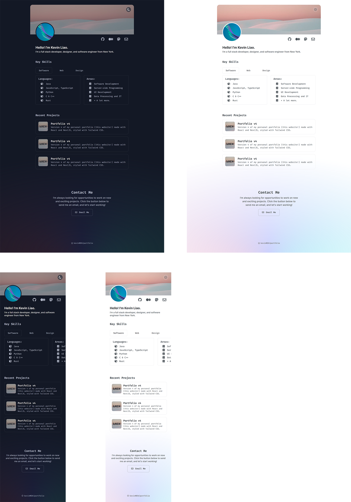

This portfolio is now outdated! For the newest version, please visit: [https://github.com/kevinMEH/portfolio](https://github.com/kevinMEH/portfolio).

# Portfolio

Version 4 of my personal portfolio, made with NextJS and styled using Tailwind CSS.



---

### 💡 Can I fork this repository and use the code for my own website?

Yes, as long as you give me attribution!

Keep in mind that this project is licensed under GPLv3, so if you want to distribute modified versions of the code, [you will have to do so under the same license (GPLv3).](https://choosealicense.com/licenses/gpl-3.0/)

Just keeping the `kevinMEH/portfolio` link at the bottom (or some version of it) is enough. You can also choose to attribute in some other way, as long as interested readers could tell that the original project is this one.

## 📝 Modification Guide

- `components` - Where all components are stored, plus some miscellaneous functions.
- `frames` - Where the various sections of the page is stored.
- `images` - Change your banner, profile picture, and other pictures here!

---

- `frames/Banner.tsx`
  - Change the banner image.
- `frames/Profile.tsx`
  - Change the profile picture, links, and icons.
  - You can optionally enable label texts for the links by uncommenting the `<p>`s.
    - Only recommended if you have 3 or fewer links, or the links section will interfere with profile picture sizing.
    - Add `md:text-lg` to the wrapper div if you do enable labels. There is a comment above the div indicating where you should put the style.
- `frames/Skills.tsx`
  - Slides and slide content.
  - You can also change the icon imports.
- `pages/index.tsx`
  - Change the title and description of the site.

---

### 🎨 Changing colors:
- Change the theme colors over at `tailwind.config.js`
- Change the `theme-color` meta tags over at `index.tsx`
- Change the gradient colors at `styles/global.css`

## 🪛 Installation

First, clone this project to your local machine:

```bash
git clone https://github.com/kevinMEH/portfolio.git
```

Navigate into the project directory, and install dependencies:

```bash
npm install
```

Next, start the development server:

```bash
npm run dev
```

Open [http://localhost:3000](http://localhost:3000) with your browser, and you're done! 🎉

## Learn More

[Learn Next.js](https://nextjs.org/learn) - Learn how to use NextJS.

[Tailwind CSS](https://tailwindcss.com) - Get started with Tailwind CSS.
